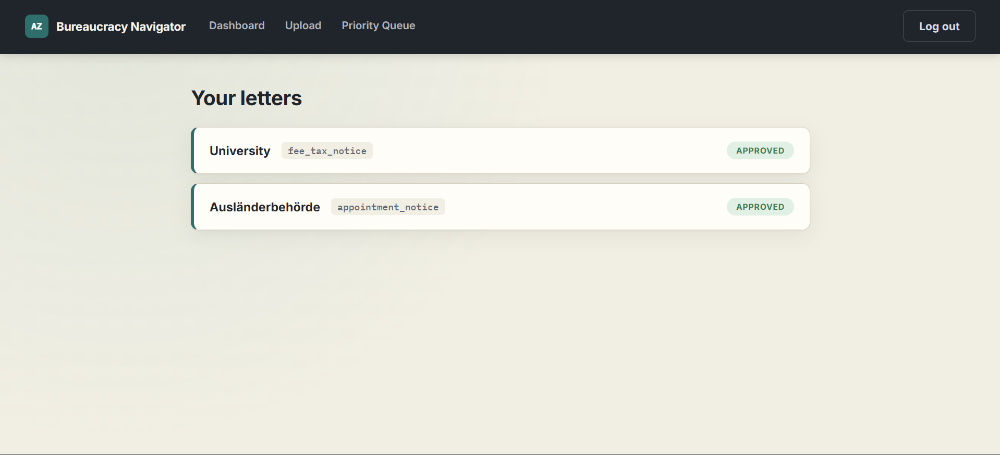

# Bureaucracy Navigator

Agentic AI system for German bureaucracy letters — Gemini multimodal extraction with self-check
confidence scoring, an async FastAPI/Redis/Postgres pipeline, a zero-LLM conflict and priority
engine, and human-approved `.ics` calendar + draft-reply generation, surfaced through a React
dashboard.

**Live:** [bureaucracy-navigator-gamma.vercel.app](https://bureaucracy-navigator-gamma.vercel.app)
— backend at [bureaucracy-navigator.onrender.com](https://bureaucracy-navigator.onrender.com)
([`/health`](https://bureaucracy-navigator.onrender.com/health)) — sign up with any email and
upload one of the sample letters in `data/sample_letters_images/` to try it.



## What this is

Bureaucracy Navigator reads official German bureaucracy letters (Ausländerbehörde, Finanzamt,
Krankenkasse, university, Bürgeramt) and turns them into something an international student or
worker can actually act on: extracted deadlines, required actions and documents, a
priority-ranked queue when multiple letters compete for attention, a downloadable `.ics` calendar
file, and a draft German reply — with a human always confirming before anything becomes final.

It was built as a portfolio project to demonstrate agentic system design beyond "one LLM call in
a chat window": a background job queue instead of a blocking request, multi-user auth, a
deterministic (zero-LLM) conflict/priority engine, and a self-check pass that measures its own
false-confidence rate rather than reporting a single flattering accuracy number.

### The pipeline

```
upload → classify & extract (Gemini, multimodal) → self-check (confidence per field)
       → priority/conflict scoring (pure Python, no LLM) → human reviews & approves
       → .ics export + draft reply generation
```

Nothing generates a calendar event or a draft reply before a human has explicitly approved the
extracted data. That gate is enforced in code (`Extraction.approved`), not just a UI convention —
every downstream endpoint checks it and refuses to run without it.

## Tech stack

| Layer         | Choice                              | Note                                              |
|---------------|--------------------------------------|----------------------------------------------------|
| API           | FastAPI                              |                                                      |
| LLM           | Gemini (multimodal)                  | reads the letter image directly, no separate OCR   |
| Validation    | Pydantic                             | extraction schema, retried once on failure         |
| Database      | PostgreSQL + SQLAlchemy              | multi-user, real relations                          |
| Queue         | Redis + RQ                           | async background processing                         |
| Auth          | JWT — python-jose + passlib          | signup/login, letters scoped to user_id            |
| Calendar      | Hand-written RFC 5545 builder        | see `backend/app/ics_builder.py` — the `ics` PyPI package was dropped after a dependency dead-end (see build log) |
| Frontend      | React + Vite                         | auth, upload, dashboard, letter detail, priority queue |
| Container     | Docker + docker-compose              | postgres, redis, api, worker, frontend             |
| Tests         | pytest                               | schema validation, conflict engine, 1 API integration test (36 tests) |

## API endpoints

All `/letters*`, `/job*`, and `/priorities` routes require a `Bearer` JWT (from `/auth/login` or
`/auth/signup`) and are scoped to the requesting user — accessing another user's letter or job
returns a `404`, never a `403` (so a user can't distinguish "doesn't exist" from "not yours").

| Method | Path                          | Auth | Description                                                                 |
|--------|-------------------------------|:----:|-------------------------------------------------------------------------------|
| GET    | `/`                            |      | Liveness check                                                               |
| GET    | `/health`                      |      | Health check                                                                 |
| POST   | `/auth/signup`                 |      | Create a user (JSON `{email, password}`) → JWT                              |
| POST   | `/auth/login`                  |      | Log in (form-urlencoded `username`/`password`, OAuth2 convention) → JWT      |
| POST   | `/letters`                     |  ✅  | Upload a letter image (PNG, multipart) → enqueues the pipeline, returns `letter_id`/`job_id` |
| GET    | `/job/{job_id}`                |  ✅  | Poll a job's status: `queued` → `processing` → `done` / `failed`             |
| GET    | `/letters`                     |  ✅  | List the current user's letters with job status + summary                    |
| GET    | `/letters/{letter_id}`         |  ✅  | Full letter detail: all extracted fields, per-field confidence, draft, approval state |
| PATCH  | `/letters/{letter_id}`         |  ✅  | Edit extracted fields (partial update). `409` once the letter is approved     |
| POST   | `/letters/{letter_id}/approve` |  ✅  | The human-confirm gate. Idempotent — safe to call repeatedly                  |
| GET    | `/letters/{letter_id}/ics`     |  ✅  | Download a `.ics` calendar file. `409` if not yet approved, `404` if no deadlines |
| POST   | `/letters/{letter_id}/draft`   |  ✅  | Generate (once) a draft reply — German body + English summary. `409` if not yet approved |
| GET    | `/priorities`                  |  ✅  | Priority-ranked queue of unapproved letters + flagged scheduling conflicts    |

Interactive docs (Swagger UI, with a built-in "Authorize" flow) are available at
`http://localhost:8000/docs` once the API is running.

## Project structure

```
bureaucracy-navigator/
  backend/
    app/
      main.py                   # FastAPI routes
      auth.py                   # signup, login, JWT issue/verify
      db.py                     # SQLAlchemy engine/session
      models.py                 # User, Letter, Extraction, Job
      schemas.py                # Pydantic request/response schemas
      queue.py                  # Redis connection + RQ queue
      worker.py                 # background job: classify → self-check → persist
      priority.py                # conflict/priority engine (zero LLM calls)
      ics_builder.py             # hand-written RFC 5545 .ics generator
      pipeline/
        classify_extract.py     # Gemini call #1: extraction
        self_check.py           # Gemini call #2: per-field confidence
        draft_reply.py          # Gemini call #3: draft reply generation
    unit tests/
      test_priority.py          # 24 tests, conflict/priority engine
      test_schemas.py           # 11 tests, Pydantic extraction/self-check schema validation
      test_api.py               # 1 real end-to-end test: signup -> login -> auth-scoped access
    conftest.py                  # throwaway SQLite test DB + FastAPI TestClient fixture
    Dockerfile
    requirements.txt
  frontend/
    src/
      api/client.js             # axios instance + auth-header interceptor
      context/AuthContext.jsx   # JWT state, login/signup/logout
      components/
        ProtectedRoute.jsx
        StatusPill.jsx
      pages/
        Login.jsx
        Signup.jsx
        Dashboard.jsx
        Upload.jsx
        LetterDetail.jsx
        PriorityQueue.jsx
      App.jsx
      main.jsx
  data/
    sample_letters/             # fictional test letters (persona: Amara Diallo)
    labels.json                 # hand-labeled ground truth
  eval/
    run_eval.py
    results_day2.json           # baseline — kept as-is, not cleaned up
    results_day3.json
    results_final.json          # final scored run — see Evaluation section below
    error_analysis.md           # honest write-up: what works, what doesn't, and why
  docker-compose.yml
  README.md
```

## Evaluation

Scored against 16 hand-labeled practice letters spanning 5 document types. Full methodology,
every fix made, and what's honestly still broken: [`eval/error_analysis.md`](eval/error_analysis.md).

| Metric | Score |
|---|---|
| Letter type accuracy | 75% |
| Deadline date accuracy | 87.5% |
| Action classification accuracy | 62.5% |
| False confidence rate | 10.5% (2 of 19 high-confidence calls were wrong) |

Two real bugs were found and fixed while building this eval, not just reported after the fact:
the extraction prompt never pinned an output language, so roughly half of the `required_actions`
came back in German instead of English until fixed; and the self-check pass rated a wrong
letter-type classification "high confidence" twice (both times a letter mentioning a payment got
mislabeled as a tax/fee notice) — the concrete failure case the false-confidence metric exists to
catch. Both are written up with the actual letters and numbers in `error_analysis.md`, including
what was deliberately left unfixed and why.

## Running it locally

Requirements: Docker, Docker Compose, Node.js.

1. Create `.env` in the project root with `GEMINI_API_KEY`, `JWT_SECRET`, and `JWT_ALGORITHM`
   (e.g. `HS256`).
2. Start the backend stack:
   ```
   docker compose up -d
   ```
   This runs Postgres, Redis, the FastAPI API (port 8000), and the background worker.
3. Start the frontend:
   ```
   cd frontend
   npm install
   npm run dev
   ```
4. Open `http://localhost:5173`, sign up, and upload a letter (PNG only).

## Deployment

| Layer         | Host                                                                            | Notes |
|---------------|----------------------------------------------------------------------------------|-------|
| Frontend      | [Vercel](https://bureaucracy-navigator-gamma.vercel.app)                        | root dir `frontend`, Vite auto-detected, deploys on push to `main` |
| Backend       | [Render](https://bureaucracy-navigator.onrender.com)                            | Docker runtime, root dir `backend`, free tier |
| Database      | Neon (Postgres)                                                                  | connection string as Render env var `DATABASE_URL` |
| Queue / cache | Upstash (Redis, TLS)                                                             | connection string as Render env var `REDIS_URL` (`rediss://`) |
| Worker        | in-process on Render (`RUN_WORKER_IN_PROCESS=true`)                             | see below — free tier has no separate worker dyno, so the RQ worker runs as a background thread inside the same container as the API |
| Keep-alive    | [`.github/workflows/keep-backend-alive.yml`](.github/workflows/keep-backend-alive.yml) | GitHub Actions cron, pings `/health` every 10 min so Render's free tier doesn't spin the container down |

